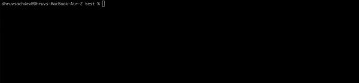

# dlgo
Downloader accelerator in Go.

It splits your file and downlods it in parallel using go routines.

## When does it actually help?
- When you really want to download a large file
- When the server you are downloading from supports range requests
- When server can handle multiple requests concurrently

## Installation
- Clone and build the project
- Set the path to the build binary so that it can be run from anywhere
For example:
If you are on zsh shell like me then you can add the following line to your .zshrc file

```export PATH="/path/to/your/dlgo/directory:$PATH"```

## Usage
```dlgo download -u <url> -w <workers> -o <output>```

example run command:
```dlgo download -u https://research.nhm.org/pdfs/10592/10592-001.pdf -w 2 -o out.pdf```


